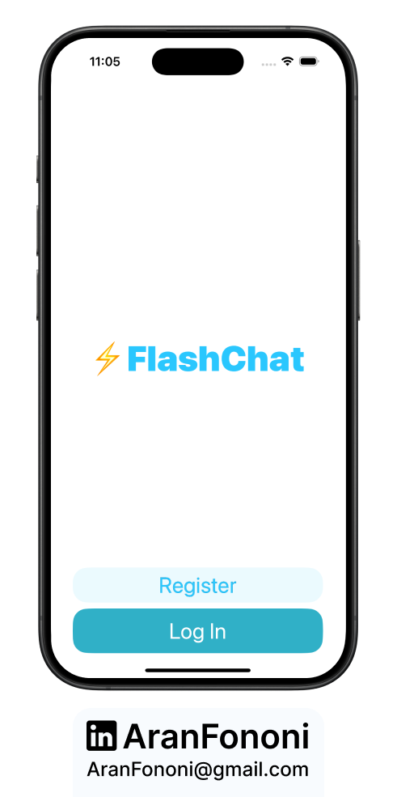
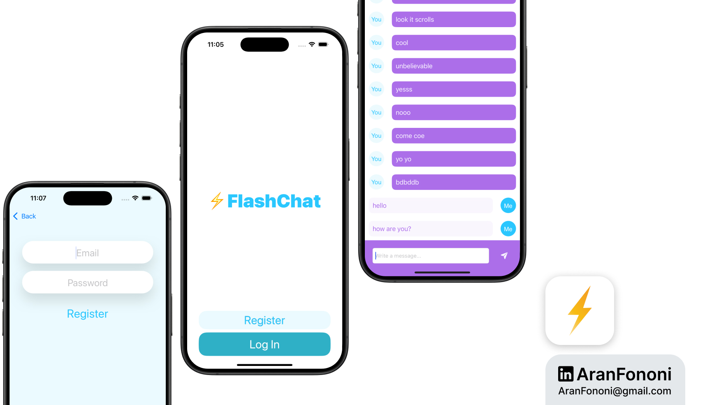

# Flash Chat

### Project for Section 15: **Real-time Chat Application**  
This project was completed as part of Section 15 in the **Complete iOS Development Bootcamp** by Angela Yu.

## Project Overview
**Flash Chat** is a real-time chat application that allows users to send and receive messages instantly. Leveraging Firebase for authentication and Firestore for data storage, the app provides a seamless messaging experience.

## What I Learned
In this project, I focused on:
- **Firebase Integration**: Implemented Firebase Authentication and Firestore for real-time data storage and retrieval.
- **TableView Management**: Utilized UITableView to display messages in a chat format.
- **Asynchronous Data Handling**: Used listeners to update the UI in real-time based on database changes.

## Key Skills
- Proficient in using Firebase for user authentication and data management
- Experience in managing UITableView data source and delegate methods
- Understanding of how to create a user-friendly messaging interface

## Additional Features
The app includes user login, registration, and a welcome screen. It supports message sending and real-time updates, making it a complete chat solution.

---

### Project Preview

---

### Footer

---

## Contact
For more information, feel free to reach out:  
- **Email**: [aranfononi@gmail.com](mailto:aranfononi@gmail.com)  
